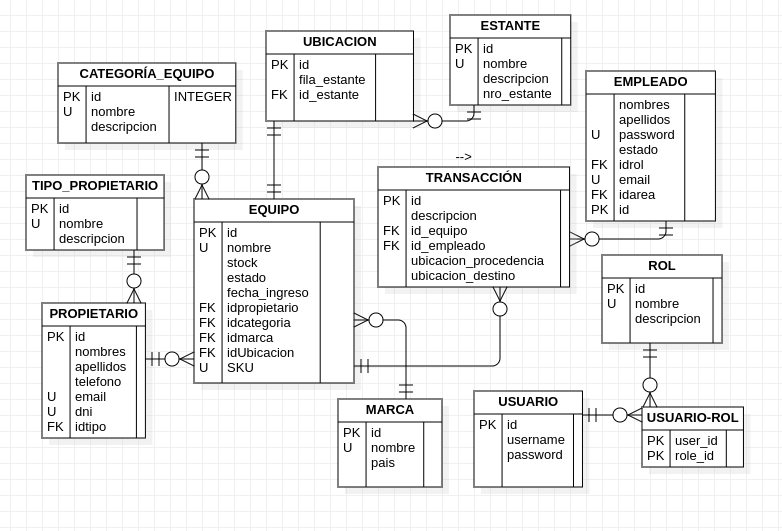

### Inventory System
Este sistema esta construido con tecnologías WEB tales como Spring Boot y Vue, además esta MySQL como SGBD

Éste proyecto consiste en gestionar los datos de una empresa que brinda servicios de telecomunicaciones.

### En el backend (Spring Boot) tenemos las siguientes características
* Validación de tipo de datos
* Mensajes de error personalizados
* Código de status apropiados para las respuestas 
* Utilización de vistas manipuladas con el ORM Hibernate
* Existen 2 roles en el sistema "USER" y "ADMIN" del cual el segundo tendrá acceso global en el sistema
* Autorización y Autenticación gestionadas con Spring Security.
* MySQL como SGBD desplegado en AWS con el servicio RDS

También se utilizó herramientas como JIB Maven Plugin y Maven Profiles para automatizar y agilizar el proceso de empaquetación del proyecto y creación de un contenedor Docker para su posterior despligue.

### En el FrontEnd (Vue JS) tenemos las sisguientes características
* Validación de campos de los formularios
* Mensajes de error etiquetados
* Acceso condicionado a las vistas y redireccionamiento 
* Ventanas emergentes de confirmación de una acción

### Enlace del backend desplegado en Render.com
https://inventory-container.onrender.com

## Entitad Relación

